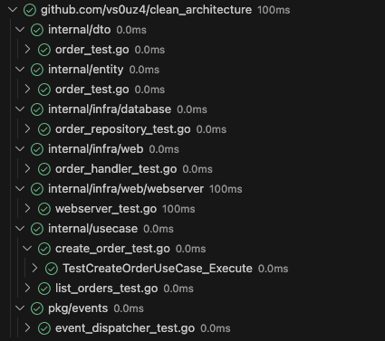
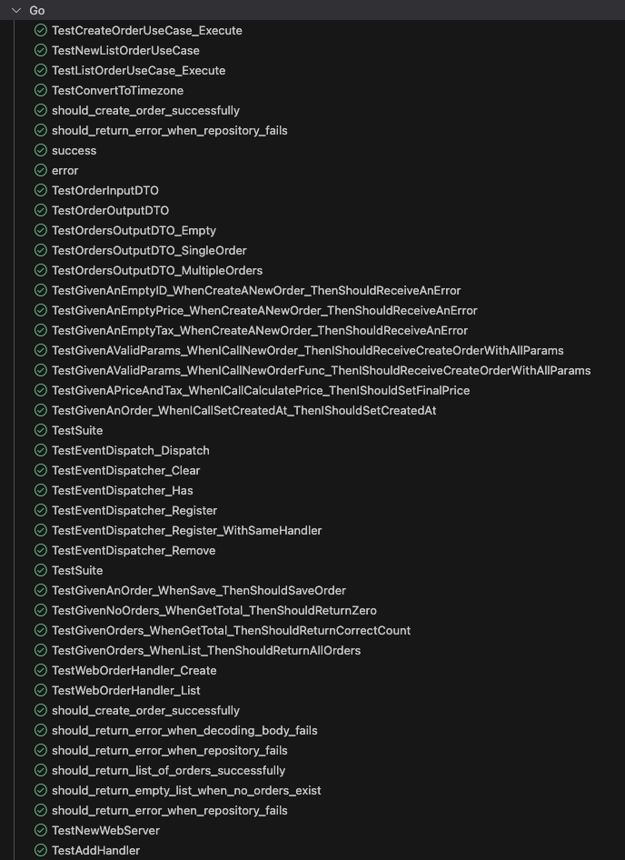

# Go Clean Architecture

> [!IMPORTANT]  
> Para poder executar o projeto contido neste repositório é necessário que se tenha o Go instalado no computador. Para maiores informações siga o site <https://go.dev/>

## Desafio GoLang Pós GoExpert - Clean Architecture

Este projeto é parte de um desafio da Pós GoExpert, nele são cobertos os conhecimentos em Go Rotines, channels, contextos, tratamentos de erros, packages, Clean Architecture, gRPC, GraphQL, APIRest, Eventos, DI.

O Desafio consiste em entregar um `endpoint` para listagem das Ordens de Compras realizadas.

### Requisitos a serem seguidos

A listagem de `orders` precisa ser realizada da seguinte maneira:

* O `endpoint` REST atenderá na rota (GET /order);
* Um `service` ListOrders com gRPC;
* Uma `query` ListOrders em GraphQL.

> Devemos criar as `migrations` necessárias e também o arquivo `api.http` com as requests para criar e listar as `orders`.

Para a criação do banco de dados, devemos utilizar o Docker (Dockerfile|docker-compose.yaml), com isso ao rodar o comando `docker compose up` tudo deverá subir, já deixando todo o ambiente de INFRA preparado, levantando o RabbitMQ e o MySQL.

Criar documentação `README.md` descrevendo passo a passo como executar a aplicação e em quais portas cada serviço deverá responder.

### Extras Adicionados

Como o exercício não mencionava como deveríamos ordenar a listagem, decidi implementar a `order` um campo `created_at` e modo a poder ordena-las pela data de criação das mesmas de forma descendente, assim acredito que a listagem ficaria melhor. Além disto foi criado um `Makefile` contendo os comando mais utilizados no projeto, encurtando os mesmos e tornando de certa forma as suas execuções mais ágeis. Abaixo as opções disponíveis no `Makefile`.

```plaintext
❯ make
Opções disponíveis no Makefile:
check_tools          Verifica se as ferramentas necessárias estão instaladas
gen-graphql          Efetua a geração dos arquivos graphql
gen-proto            Efetua a geração dos arquivos protobuffer
help                 Exibe este menu de ajuda
migration-down       Reverte as migrações aplicadas na base de dados
migration-drop       Elimina as migrações aplicadas na base de dados
migration-up         Aplica as migrações na base de dados
run                  Inicializa o servidor da aplicação
test                 Executa a suite de testes
```

Como o projeto princpial continha eventos, mantive os eventos para o fluxo de criação de `orders` e para isto adicionei a INFRA toda automação para criação da `queue` e `binding` necessário o funcionamento. O console para do RabbitMQ também está presente no projeto, sendo acessível utilizando os dados de acesso abaixo:

```plaintext
username: guest
password: guest
```

> O console do RabbitMQ toda a aplicação estar provisionada estará disponível através do endereço `http://127.0.0.1:15672/`

Aproveitei que o módulo de clean-architecture possuia alguns poucos testes unitários e ampliei a cobertura dos testes no projeto.

Cobertura de testes adiciona aos arquivos



Alguns cenários de testes adicionados



### Executando os Sistemas

Existem duas formas de executarmos os sistemas, ambas executando o mesmo comando, uma mantendo o terminal preso, onde veremos os `logs` em tempo real, ideal para depuração e outra em segundo plano, ou o terminal fica livre e os `logs` só podem ser vistos através do comando `docker-compose logs <container-id>` ou `docker-compose logs`.

Ao executar o os comandos apresentadoa a seguir, no ato da inicialização do projeto, em ambos os casos toda a INFRA será provisionada antes do sistema ser inicializado.

#### Modo Depuração

* Inicializando os serviços...

Para executar o sistema, basta executarmos o seguinte comando abaixo:

```shell
❯ docker-compose up
```

Na janela do terminal, você deverá ver uma mensagem parecida com o exemplo abaixo:

```shell
rabbitmq   | wait-for-it.sh: rabbitmq:5672 is available after 4 seconds
rabbitmq   | RabbitMQ está disponível.
rabbitmq   | Importing definitions in JSON from a file at "/etc/rabbitmq/definitions.json" ...
rabbitmq   | Successfully started definition import. This process is asynchronous and can take some time. Watch target node logs for completion.
app        | Starting web server on port :8000
app        | Starting gRPC server on port 50051
app        | Starting GraphQL server on port 8080
migrate-1  | no change
migrate-1 exited with code 0
```

* Encerrando os serviços

Para encerrar os serviços, estando no modo de execução atachado, bastar que pressionemos `Ctrl+C` e o processo de encerramento dos containers se iniciará imediatamente, ao fim do processo você deverá ver em sua janela de terminal algo parecido com o exemplo abaixo:

```shell
^CGracefully stopping... (press Ctrl+C again to force)
[+] Stopping 4/4
 ✔ Container clean_architecture-migrate-1  Stopped   0.0s 
 ✔ Container app                           Stopped   0.1s 
 ✔ Container rabbitmq                      Stopped   10.1s 
 ✔ Container mysql                         Stopped   0.8s
```

#### Modo Segundo Plano

* Inicializando os serviços

Para executar o sistema, basta executarmos o seguinte comando abaixo:

```shell
❯ docker-compose up -d
```

Na janela do terminal, você deverá ver uma mensagem parecida com o exemplo abaixo:

```shell
❯ docker compose up -d
[+] Running 6/6
 ✔ Network clean_architecture_default         Created   0.1s 
 ✔ Container rabbitmq                         Healthy   5.7s 
 ✔ Container mysql                            Healthy   5.7s 
 ✔ Container clean_architecture-migrate-1     Started   5.8s 
 ✔ Container app                              Started   5.8s 
```

* Encerrando os serviços

Já no modo de execução em segundo plano para finalizarmos os containers que estão rodando fazendo assim com que os serviços sejam encerrados, basta que executemos o seguinte comando:

```shell
❯ docker compose down
```

Na janela do terminal, você deverá ver uma mensagem parecida com o exemplo abaixo:

```shell
❯ docker compose down
[+] Running 5/5
 ✔ Container clean_architecture-migrate-1  Removed   0.0s 
 ✔ Container app                           Removed   0.1s 
 ✔ Container rabbitmq                      Removed   10.2s 
 ✔ Container mysql                         Removed   0.8s 
 ✔ Network clean_architecture_default      Removed   0.1s 
```

### Informações dos Serviços

**APIRestful - [Porta 8000]**

```plaintext
GET /order  - Listagem de todas as `orders`
POST /order - Criação de uma `order`
```

**GraphQL - [Porta 8080]**

```plaintext
Query
    - orders: [Order!]!
Mutation
    - createOrder(input: OrderInput): Order
```

**gRPC - [Porta 50051]**

```plaintext
Services
    - CreateOrder (input)
        input(
            id (TYPE_STRING)
            price (TYPE_FLOAT)
            tax (TYPE_FLOAT)
        )
    
    - ListOrders(input)
        - input (empty)
```
